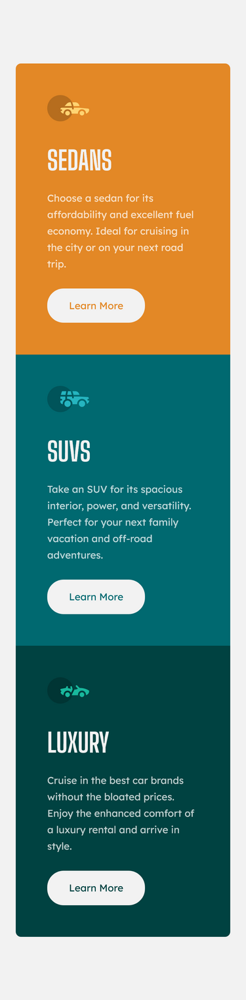
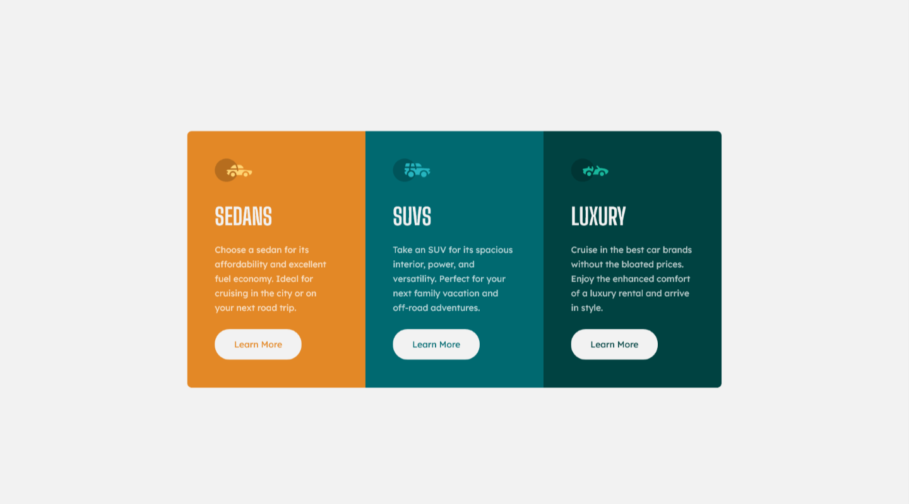

# Frontend Mentor - 3-column preview card component solution

This is a solution to the [3-column preview card component challenge on Frontend Mentor](https://www.frontendmentor.io/challenges/3column-preview-card-component-pH92eAR2-). Frontend Mentor challenges help you improve your coding skills by building realistic projects.

## Table of contents

- [Overview](#overview)
  - [The challenge](#the-challenge)
  - [Screenshot](#screenshot)
  - [Links](#links)
- [My process](#my-process)
  - [Built with](#built-with)
  - [What I learned](#what-i-learned)
  - [Useful resources](#useful-resources)
- [Author](#author)

## Overview

### The challenge

Users should be able to:

- 1 - View the optimal layout depending on their device's screen size
- 2 - See hover states for interactive elements

### Screenshot

#### Mobile View



#### Desktop View



### Links

- Solution URL: [Github Repository](https://github.com/Saurav-98/FEM-3-column-preview-card-component)
- Live Site URL: [Live Link](https://fem-saurav-3-column-card-component.netlify.app/)

## My process

### Built with

- Semantic HTML5 markup
- CSS custom properties
- Flexbox
- Mobile-first workflow
- vite frontend tooling

### What I learned

I just completed the 3-column preview card component challenge on Frontend Mentor, and I'm really happy about the result! I focused on using Semantic HTML5 to structure the content properly and enhance accessibility. CSS custom properties (variables) were a game-changer; they allowed me to manage styles efficiently, and I can easily make global changes. I also adopted a mobile-first approach, prioritizing the mobile design to ensure a great user experience on smaller screens. Media queries were key to making my design responsive. I used them to fine-tune the layout and styles for different screen sizes, making sure everything looked perfect. Flexbox was my go-to for layout, making everything flexible and responsive.

Through this challenge, I learned a lot about responsive design, the power of CSS variables, the importance of media queries, and had the chance to hone my problem-solving skills. It's been a fantastic learning experience, and I'm excited to take on more challenges to keep improving my development skills!

I'm thrilled to highlight that I achieved a fantastic responsive design in just 4 lines of code, all neatly placed within a single media query.

To see how you can add code snippets, see below:

```css
@media (min-width: 700px) {
  body {
    padding-block: 10.6875rem;
  }
  .cards__container {
    flex-direction: row;
    max-width: 57.5rem;
  }
}
```

### Useful resources

- [web.dev: Learn HTML!](https://web.dev/learn/html/) - This helped me in laying out the content in semantic HTML, which is accessible and easy to style with custom CSS classes. I really loved this pattern and want to use it in the future.

- [web.dev: Learn CSS!](https://web.dev/learn/css/) - This is an incredible CSS tutorial with the most accurate and best practices explained with examples, great explanation, easy to navigate, and my go-to tool for any CSS related query.

## Author

- Website - [Saurav Kumar Verma](https://github.com/Saurav-98)
- Frontend Mentor - [@Saurav-98](https://www.frontendmentor.io/profile/Saurav-98)
- Twitter - [@SauravKverma22](https://twitter.com/SauravKverma22)

Please Like my solution on Frontend mentor and star my repo in github.
